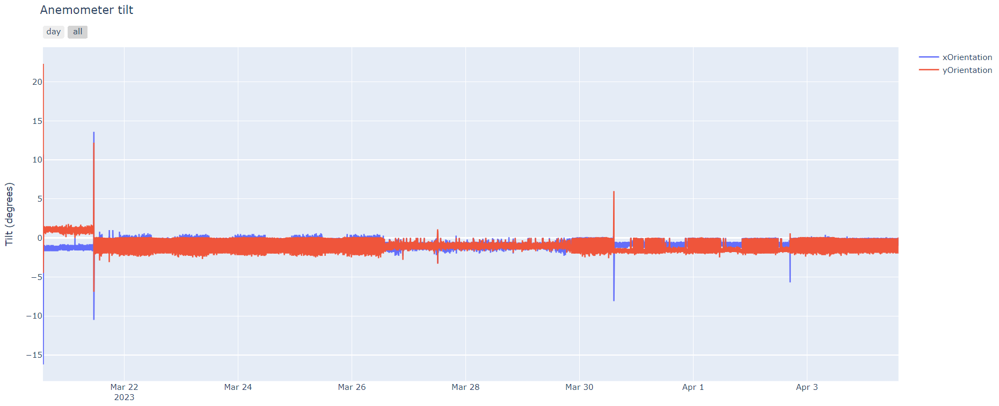
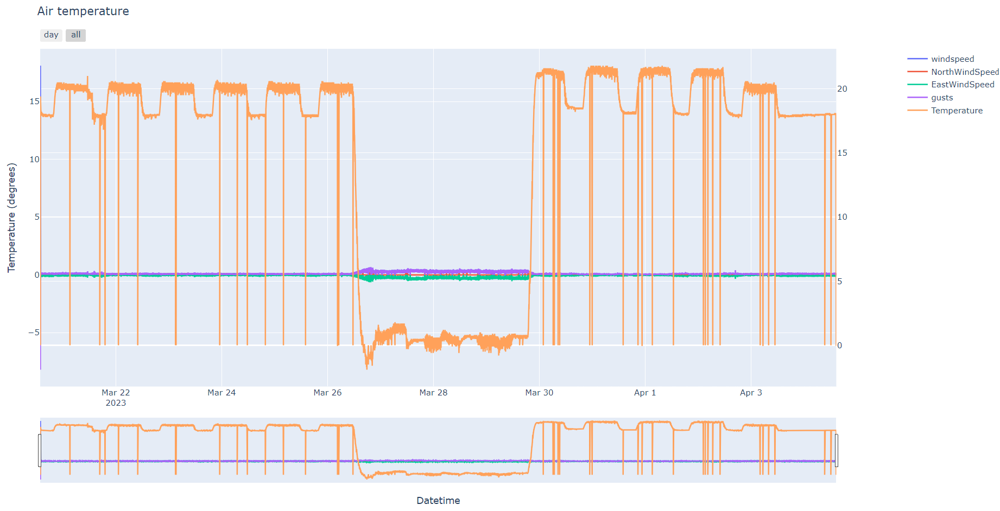
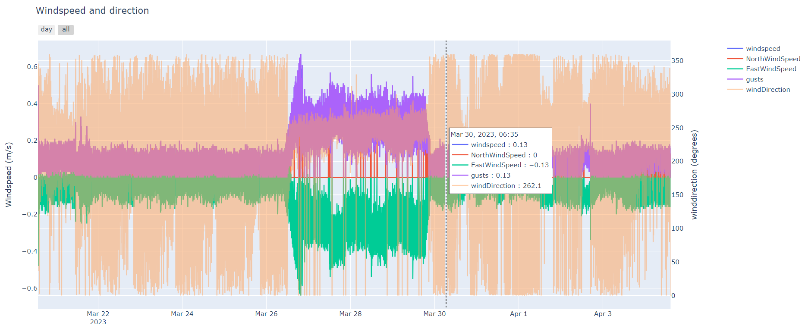
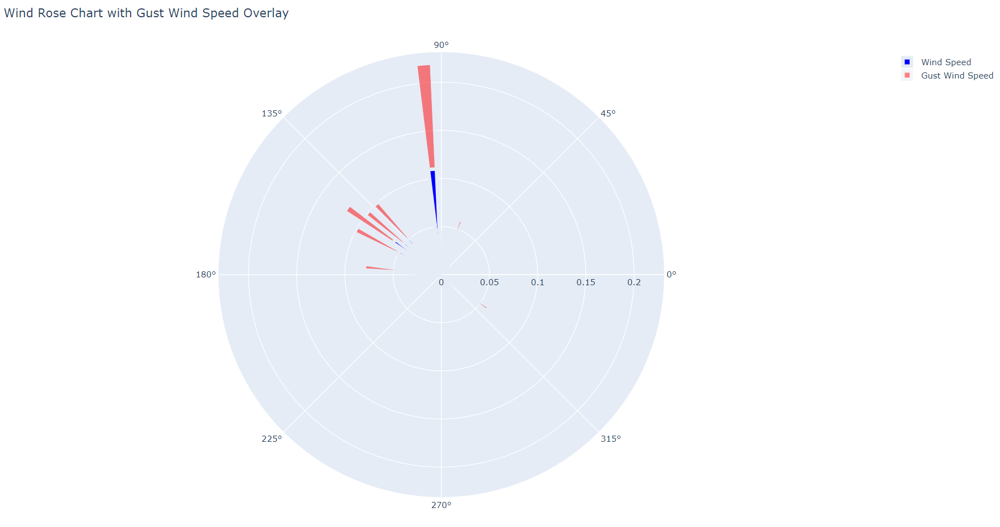

# Initial analysis of Anemometer data 
Example of the basic analysis off anemometer data applied to meassuements taken in the climateceels of the NPEC facility (testdata).
The climatecells behaves different than outside weather, and the goal of the analysis was mainly to check the cells operations.
Therefore, no advanced statistics ot modeling techniques like computation flued dynamics (CFD) are applied. 
Yet, this scripts might help other users take a first peak into the data.

Plots:

